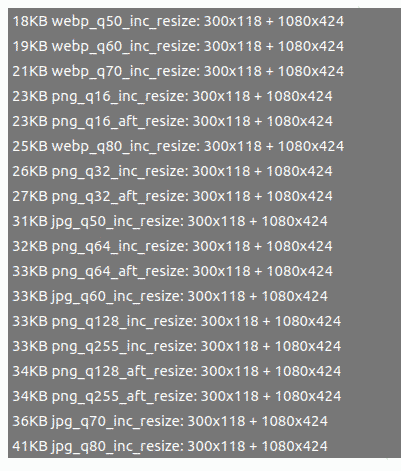
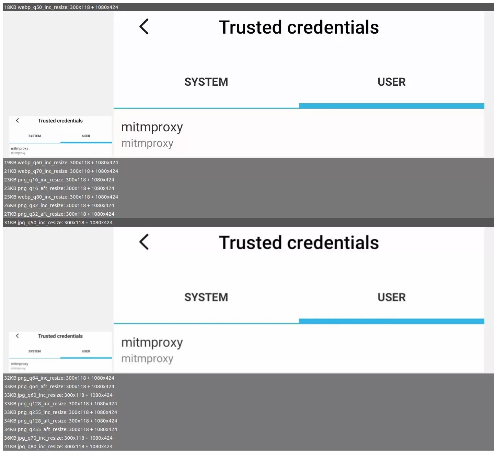

# WP Image Compressor


I wrote about the manual commands to do something about
[WordPress's wasted storage when resizing uploaded images](
https://silverbullets.co.uk/wordpress/wordpress-image-resizing-png-jpg-and-webp/).
Typing them was time-consuming and a potential barrier to self-hosting images.
While my shell's history was full of them (or more likely my PC full of
terminals left open to do this day after day) I was reasonable safe from error.

I wrote that post 6 months ago and had to re-read it before going ahead
with writing more posts. What better way to return to productivity than that
script I'd been hankering after.

I'm also providing accompanying an accompanying "library" to interact with
the API from python, `wp_api`, using my newly learned "application passwords".

I decided to split this code into its own repository so it can be public
and have decent tests. The Vagrantfile is all you need to run them locally.
Github Workflows take care of the same, on Github's cloud.

## Usage

Your Linux environment must provide imagemagick. I've only tested on Ubuntu
20 and 22. I've used python 3.8 - 3.10.

One argument, the image name, is required. Your config file can be specified
additionally or you can copy `tests/config_template.json` to the starting
directory, as `config.json`, and adapt it. The test run by vagrant do this
so I am just going to reference it:

```shell
vagrant@testrunner:/vagrant/img_compressor$ python3 compressor.py ../gallery_of_results.png -c ../tests/config.json
Please review the results at file:///home/user/PycharmProjects/wp_automations/img_compressor/gallery.html and select the set you prefer.
 0: 26KB, jpg_q50_inc_resize
 1: 30KB, jpg_q60_inc_resize
 2: 31KB, webp_q50_inc_resize
 3: 31KB, png_q16_inc_resize
 4: 32KB, png_q16_aft_resize
 5: 34KB, webp_q60_inc_resize
 6: 34KB, jpg_q70_inc_resize
 7: 34KB, png_q32_inc_resize
 8: 35KB, png_q32_aft_resize
 9: 37KB, png_q64_inc_resize
10: 38KB, webp_q70_inc_resize
11: 38KB, png_q64_aft_resize
12: 39KB, png_q128_inc_resize
13: 39KB, png_q255_inc_resize
14: 39KB, png_q255_aft_resize
15: 40KB, png_q128_aft_resize
Choose [0-15]:
```

Here it is recommended to open the linked gallery.html and confirm any trade
offs of size for fidelity, if any, and the chosen format and q settings.

### Initial gallery view


### Comparative gallery view


The chosen set of images is then uploaded using the host and credentials
described in whatever config.json you provided the script and deleted from
the tmp subdirectory where you ran it. The only resized image **not** replaced
is the thumbnail (150x150 or smaller) since it is generated
on a different algorithm, and already needs very few KB.

Should credentials and host not be correct, the script will fail and leave
the tmp directory, pictured in the gallery. This should be deleted, but any
contents can be salvaged manually, beforehand.

## Real world usage

```shell
:~/PycharmProjects/wp_img_compressor$ PYTHONPATH=.. python3 img_compressor/compressor.py tests/testing-how-it-looked-installed.png
```

The default location of the config.json is the current working directory. While
you will get an error if you run it without a valid config, ie against other
than the WordPress server provided in the Vagrant, you still get the gallery
view and tmp directory containing the generated images.

## Problem

I uploaded some images  as jpeg about a year ago. Now I see their thumbnails
are blank in the media library. This is because I replace them with PNGs. The
pages that use them know this and work, but WordPress is confused. I updated
the SQL but nothing much changed.

```shell
mysql> select id, post_mime_type, guid from wp_posts where post_mime_type = "image/jpeg" limit 25;
+----+----------------+--------------------------------------------------------------------+
| id | post_mime_type | guid                                                               |
+----+----------------+--------------------------------------------------------------------+
| 26 | image/jpeg     | <hostname> /wp-content/uploads/2021/08/credential-use.png          |
| 27 | image/jpeg     | <hostname> /wp-content/uploads/2021/08/how-it-looked-installed.png |
| 28 | image/jpeg     | <hostname> /wp-content/uploads/2021/08/menu-for-these-certs.png    |
+----+----------------+--------------------------------------------------------------------+
3 rows in set (0.00 sec)

mysql> update wp_posts set post_mime_type = "image/png" where post_mime_type = "image/jpeg";
```

I'll be find-replacing next time I get an SQL dump to work with.


## TODO

- unit tests for non-default size settings.
- test paths when they contain a space
- use other versions of python, down to 3.6 I think.


